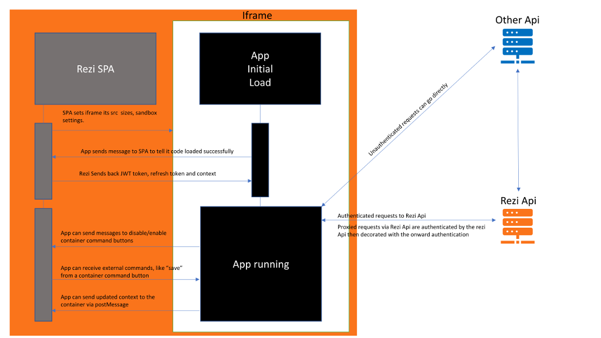

# Rezi App For Actions Menus

Actions menu apps, get context of the surrounding hub, and can obtain user information, and request any other information from the [rezi api] (http://api.dezrez.com/help)

**NB YOU ARE RESPONSIBLE FOR ANY GDPR ISSUES DOWNSTREAM OF THIS APP**

## Authentication

The apps are classed as trusted, and as such are passed the authetication token of the user. Any actions of the app will be controlled via a approval process, to monitor for unsafe api usage.

## Context

The apps will receieve context of the hub the actions menu is active in. This allows you to gain ids of entities in context and request further information from the api, or even update information using the api. 

Context will be as follows:
Property Sales Hub: {"PropertySalesRoleDetails":propertySalesRole}
Property Hub: {"PropertyDetails": property}
Property Lettings Hub: {"PropertyLettingsRoleDetails": propertyLettingsRole}
Group Hub: {"PeopleGroupDetails",peopleGroup}

You can obtain a relevant data contract by putting a break point in [ActionsViewer.js](https://rezi-web-systest.dezrez.com/App/widgets/ActionsViewer.js) at about line 154 (subject to change). **if (anAction.Data instanceof PropertySalesRole)** Here you can see an example of the object you would get should you need context.

In addition to this the details of the user is available via the [ReziApi.Me](src/app/Xhr/ReziApi.ts) call, giving you access to details of agency ids, names, contact details of the logged in user. The home branch id can be obtained using the Utility function [ParseJWT](src/app/Utilities/Utils.ts)

## External Api Calls

The apps can make REST api calls to external apps via the [apps endpoint](http://api.dezrez.com/Help/Api/POST-api-app-endpoint-provider). The call is passed through the rezi api as a proxy, decorating the onward call with any required authentication. Acceptable api authentication techniques are: Static Bearer Token, Oauth2.0, Basic, x-api-key header, url parameter, or form field. This frees the app author from having to worry about a second form of authentication in the app.

## App Development

App development is platform agnostic, the apps can be written in vanilla javascript, react, angular etc. However, there is a communication protocol to receive tokens, contexts etc, and to be able to interact with the parent application. This must be adhered to and will be monitored as part of the approval process.

## App Settings

Unlike Rezi Apps For Dashboard, these action menu apps, cannot store settings, they should just get the information from the context and act on that information.

## App Developement Harness

[Test](src/TestApp.html)

Before you use this, please contact dezrez to discuss the concept and ask for a username and password to systest. Lines 22-25 of [AppMessaging.ts](AppMessaging.ts) can be commented out, as this just checks to see if the source is rezi. When you have logged into [systest](https://rezi-web-systest.dezrez.com/) you can get the dezrez authorization header bearer token from any call to the rezi api **This token will be valid for approx 7200 seconds**. This can be pasted into the input box. The context can also be posted into the second box.
